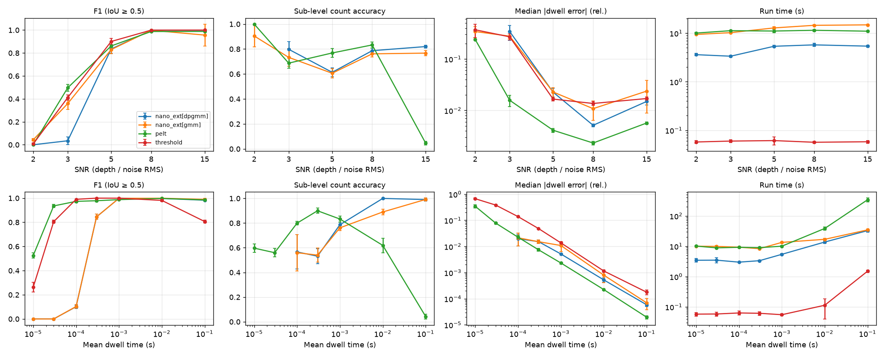
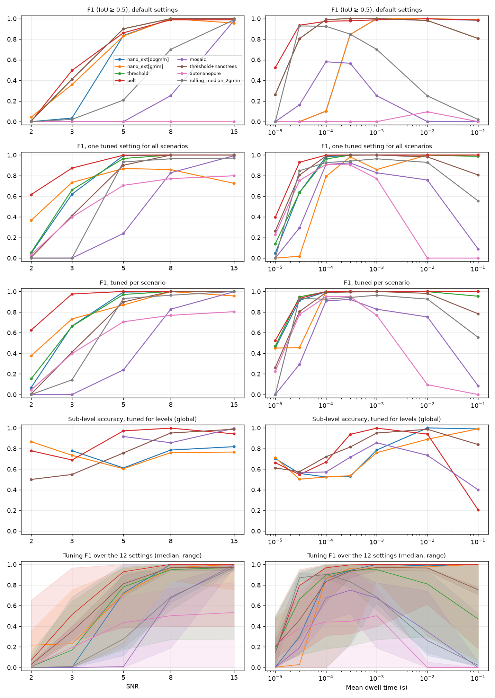
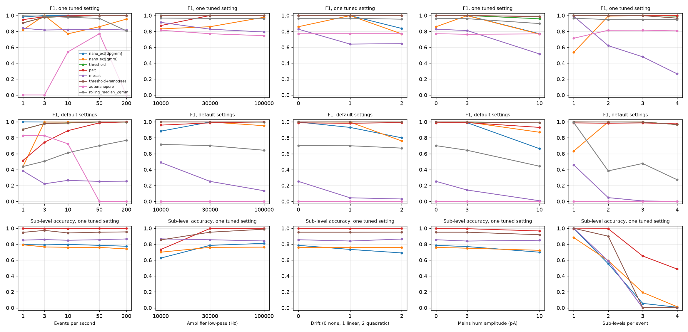

# Benchmarks

Accuracy of event detection and sub-level analysis on synthetic recordings
with known ground truth, for Nano_ext and simple reference methods. Nothing
here is part of the installed package, and generated signals are not stored
(every run regenerates them from fixed seeds).

```bash
pip install -e .                              # Nano_ext itself
pip install -r benchmarks/requirements.txt    # reference methods (ruptures)
python benchmarks/sublevel_count_repro.py     # README sub-level figure, ~1 min
python benchmarks/run_phase1.py --workers 4   # SNR / dwell-time grid, ~40 min on 4 cores
python benchmarks/run_phase1.py --quick       # smaller grid, 2 seeds
bash benchmarks/external/setup.sh             # external tools (git + uv needed)
python benchmarks/run_phase2.py --workers 4   # external tools + equal-budget tuning, several hours
python benchmarks/run_phase3.py --workers 4   # more scenario axes, default + phase-2 settings
python benchmarks/run_realdata.py --workers 2 # agreement between methods on public recordings
```

`run_phase1.py --resume` keeps finished recordings in
`results/phase1_runs.csv` and runs only the missing ones;
`--resources-only` re-measures run time and memory.

## Files

| file | content |
|---|---|
| `scenarios.py` | synthetic recordings (seeded) and their ground truth |
| `adapters.py` | methods under test, all with a common output format |
| `common.py` | event matching, metrics, shared baseline estimate of the reference methods |
| `run_phase1.py` | runs the phase-1 grid (default settings), writes `results/phase1_*` |
| `run_phase2.py` | external tools and equal-budget tuning, writes `results/phase2_*` |
| `run_phase3.py` | event rate, filter cutoff, drift, hum and sub-level count axes, writes `results/phase3_*` |
| `dpgmm_ablation.py` | DPGMM ablation (one ingredient removed at a time), writes `results/dpgmm_ablation_*` |
| `run_realdata.py` | methods on public recordings without ground truth, writes `results/realdata_*` |
| `external/` | `setup.sh` (pinned installs of the external tools into `_external/`, untracked) and the worker scripts that run MOSAIC and Nano Trees in their own environments; `fetch_poriscope_data.py` (download and SHA256 check of the Poriscope sample data) |
| `short_event_limit.py` | shortest detectable event behind a 10 kHz filter vs Nano_ext's minimum event duration, writes `results/short_event_limit*.csv` |
| `sublevel_count_repro.py` | reproduces the sub-level figure quoted in the main README |
| `results/` | phase 1: `phase1_runs.csv` (every run), `phase1_summary.csv` (mean and SD over seeds), `phase1_resources.csv`, `phase1.png`; phase 2: `phase2_tuning.csv`, `phase2_selected.csv`, `phase2_sensitivity.csv`, `phase2_test.csv`, `phase2_summary.csv`, `phase2.png` |

## Synthetic recordings

Generated with `nano_ext.testing.synthetic`:

- 250 kHz sampling, 200 pA open pore.
- A 4-pole Bessel low-pass at 30 kHz is simulated as an analog filter (4× oversampled, causal). Steps therefore have a 10–90 % rise time of ≈ 11 µs, and events appear 11 µs after their nominal start. The ground truth accounts for this delay.
- The noise goes through the same filter, as in an amplifier. It is band-limited white noise plus 1/f noise, with the 1/f part making up 30 % of the RMS.
- Events arrive as a Poisson process at ≤ 50 /s, and cover about 20 % of the time or less.
- Dwell times are log-normal (σ_log = 0.5).
- Half of the events have one level (60 pA blockade) and half have two. The second level blocks 36 pA, and the split between the two levels is drawn from Dirichlet(5, 5).
- **SNR** = first-level blockade ÷ total noise RMS of the recording.

Phase 1 varies one parameter at a time around a centre point (SNR 8, mean dwell 1 ms), with 5 seeds per point:

| axis | values |
|---|---|
| SNR | 2, 3, 5, 8, 15 |
| mean dwell time | 10 µs, 30 µs, 100 µs, 300 µs, 1 ms, 10 ms, 100 ms (≈ 1–10 000 filter rise times) |

Recordings last 4–30 s, so each has about 100–190 events (43 at 100 ms).

The generator can also add mains hum with harmonics, power-law (f¹–f²) high-frequency noise and baseline drift. These are not yet varied (next phase).

## Methods (default settings, no tuning)

| name | description |
|---|---|
| `nano_ext[dpgmm]` | `run_pipeline` with `DetectionConfig()` (current defaults: Dirichlet-process mixture threshold and sub-levels), single process |
| `nano_ext[gmm]` | same with `threshold_method="gmm", sublevel_method="gmm"` (defaults up to v1.1) |
| `threshold` | fixed threshold: an event starts where the signal drops below baseline − 5σ, and its boundaries extend outward to where it returns above baseline − 1σ (hysteresis). No sub-levels. |
| `pelt` | PELT change points on the baseline-subtracted trace (`ruptures.KernelCPD(kernel="linear")`, i.e. L2 cost, penalty 2σ² ln n). Segments whose mean lies more than 3σ below the baseline are event levels; consecutive ones form one event, one sub-level per segment. |

**Shared baseline and noise for the reference methods.** The baseline is the running 80th percentile, over 2 s, of 256-sample block medians. σ is the median absolute deviation (MAD) of the baseline-subtracted signal. Nano_ext uses its own baseline.

## Metrics

- **Matching.** Detected and true events are paired one-to-one, greedily by decreasing interval IoU (intersection over union). A pair counts as a true positive at **IoU ≥ 0.5**.
  - **Recall, precision and F1** follow from these pairs.
  - **`f1_any`** accepts any overlap instead, i.e. detection regardless of boundary accuracy.
- **`dwell_err`, `depth_err`.** Median absolute relative error over matched events.
  - Depth is the duration-weighted mean blockade relative to the baseline.
- **`level_acc`.** Fraction of matched events whose number of sub-levels is correct.
  - It is only computed for methods that report sub-levels, and only over matched events. At low F1 it rests on few events.
- **`bound_err_us`.** Median absolute error of sub-level boundaries (µs), over matched multi-level events with the right level count.
- **Run time.** Wall-clock time per recording (`phase1_runs.csv`, which is noisier because 4 recordings run in parallel).
  - `phase1_resources.csv` measures run time and peak RSS serially, each in a fresh process, on the centre scenario (1 M samples).

## Phase 1 results (default settings, mean over 5 seeds)



F1 (IoU ≥ 0.5):

| SNR | nano_ext[dpgmm] | nano_ext[gmm] | threshold | pelt |
|---|---|---|---|---|
| 2 | 0.00 | 0.04 | 0.01 | 0.00 |
| 3 | 0.03 | 0.36 | 0.41 | 0.50 |
| 5 | 0.84 | 0.83 | 0.90 | 0.86 |
| 8 | 1.00 | 1.00 | 1.00 | 0.99 |
| 15 | 1.00 | 0.96 | 1.00 | 0.99 |

| mean dwell | nano_ext[dpgmm] | nano_ext[gmm] | threshold | pelt |
|---|---|---|---|---|
| 10 µs | 0.00 | 0.00 | 0.26 | 0.53 |
| 30 µs | 0.00 | 0.00 | 0.81 | 0.94 |
| 100 µs | 0.10 | 0.10 | 0.99 | 0.97 |
| 300 µs | 0.85 | 0.85 | 1.00 | 0.98 |
| 1 ms | 1.00 | 1.00 | 1.00 | 0.99 |
| 10 ms | 1.00 | 1.00 | 0.98 | 1.00 |
| 100 ms | 0.98 | 0.99 | 0.81 | 0.99 |

Sub-level count accuracy (matched events):

| SNR | nano_ext[dpgmm] | nano_ext[gmm] | pelt |
|---|---|---|---|
| 3 | 0.80 | 0.73 | 0.69 |
| 5 | 0.61 | 0.61 | 0.77 |
| 8 | 0.79 | 0.76 | 0.83 |
| 15 | 0.82 | 0.77 | 0.05 |

| mean dwell | nano_ext[dpgmm] | nano_ext[gmm] | pelt |
|---|---|---|---|
| 100 µs | 0.57 | 0.56 | 0.80 |
| 300 µs | 0.53 | 0.54 | 0.90 |
| 1 ms | 0.79 | 0.76 | 0.83 |
| 10 ms | 1.00 | 0.89 | 0.62 |
| 100 ms | 0.99 | 0.99 | 0.04 |

Run time and memory, centre scenario (1 M samples, single thread; peak RSS increase over the loaded data):

| method | run time | peak RSS increase |
|---|---|---|
| nano_ext[dpgmm] | 5.7 s | 25 MB |
| nano_ext[gmm] | 14.5 s | 67 MB |
| threshold | 0.09 s | 46 MB |
| pelt | 10.8 s | 64 MB |

### Observations

- **Short events.** With default settings, Nano_ext discards events shorter than 5 / f_c, where f_c is its own low-pass cutoff (sampling rate / 10 = 25 kHz here), so the limit is 200 µs. Events with a mean dwell ≤ 100 µs are therefore largely missing. The simple threshold and PELT detect them down to ~30 µs (≈ 3 rise times). Setting `min_event_duration_sec` removes this limit; tuned settings are not evaluated yet.
- **Low SNR.** At SNR 3 every method struggles (F1 ≤ 0.5), and the Dirichlet-process threshold is worst (0.03). For the other three methods `f1_any` is 0.73–0.77, so most of their detections overlap a true event but with wrong boundaries or merged neighbours. For the Dirichlet-process threshold it is 0.28, i.e. it also misses events. At SNR ≥ 8 all methods detect essentially every event.
- **Sub-levels, long events.** For events of 10–100 ms the Dirichlet-process sub-level analysis finds the true count almost always (0.99–1.00). PELT with a BIC-type penalty over-segments long levels, because it reads the 1/f wander as level changes (0.04 at 100 ms), and it does the same at high SNR (0.05 at SNR 15).
- **Sub-levels, short events.** For 100 µs–1 ms events PELT is more accurate (0.80–0.90 vs 0.53–0.79). The levels there last only tens to hundreds of µs, i.e. a few filter rise times.
- **Feature accuracy.** Dwell-time errors are similar across methods (< 2 % from 1 ms up). PELT gives the smallest dwell error at most dwell times and the smallest sub-level boundary error (≈ 3 µs vs ≈ 4 µs for Nano_ext).

### Reproducing the main README figure

`sublevel_count_repro.py` reproduces the sub-level level-count accuracy quoted in the top-level README. It gives **dpgmm 1.00, gmm 0.66, bocpd 0.25** on 217 events, with the v1.1 threshold default (`--threshold-method gmm`). With the current default threshold (`dpgmm`) it gives 1.00 / 0.65 / 0.27.

That recording is favourable: every level lasts ≥ 1 ms, the blockades are deep (SNR ≈ 17–22) and there is no simulated filter. The grid above shows that accuracy drops for shorter levels.

## Phase 2: external tools and equal-budget tuning

### Additional methods

| name | what runs | notes |
|---|---|---|
| `mosaic` | MOSAIC 2.4 (NIST, PyPI `mosaic-nist`): `eventSegment` event detection, each event fitted with `cusumPlus` (CUSUM+) for sub-levels. Only events MOSAIC marks `normal` are counted. | Python 3.10 environment. Its declared dependencies include test and packaging tools that can no longer be installed (codecov 2.1.12 is gone from PyPI), so the runtime pins are installed separately. Importing it fetches analytics settings from the web and its run functions post usage events; the worker disables both. The partitioner fails on an empty last data block, so the worker appends the trace's last 20 ms (open pore), mirrored. |
| `threshold+nanotrees` | Events from `threshold` (default k = 5); sub-levels fitted inside each event (± padding) by the NanoTrees event fitter of Poriscope (commit `9d2b9e8`, MIT). | Python ≥ 3.12.10 environment. The plugin is called as in Poriscope's own unit tests, without its GUI and event loader. Its default *Smallest Significant Sublevel* (600 pA) is far above the 36–60 pA blockades here, so by default it reports one level per event. |
| `autonanopore` | AutoNanopore (commit `a44cb80`), unmodified; `event_detection` is called on an ABF copy of the recording. | The repository has no licence file, so it is fetched, not copied. Its command-line entry point never calls the detection. It keeps the largest excursion of each 30 ms window and accepts windows whose amplitude is an outlier among all windows, so it assumes most windows hold no event. With ~1.5 events per window here it finds no outliers and fails; this is counted as zero detections. On a sparse check recording (2 events/s) it reaches F1 0.64 with defaults. |

| `rolling_median_2gmm` | Rolling-median baseline, then a two-component Gaussian mixture fitted to the histogram of the residual; the event threshold follows from the two clusters. Re-implementation based on the description of cluster-based event detection in Wei et al. 2026 (bioRxiv, doi 10.64898/2026.05.07.723187); not the original authors' code. | Added after the other methods; details and results in [Rolling-median baseline + two-component GMM threshold](#rolling-median-baseline--two-component-gmm-threshold). It also serves as the fixed two-component GMM baseline. |

### Tuning protocol

- **Same budget.** Every method gets 12 parameter settings (`GRIDS` in `run_phase2.py`), covering its main detection (and, where it has them, sub-level) parameters:

  | method | parameters (12 combinations) |
  |---|---|
  | `nano_ext[*]` | `min_event_duration_sec` ∈ {auto, 10, 30, 100 µs} × `filter_cutoff` ∈ {10 kHz, auto (25 kHz), 60 kHz} |
  | `threshold` | k ∈ {3, 4, 5, 6} × exit level ∈ {0.5, 1, 2} σ |
  | `pelt` | penalty factor ∈ {0.5, 1, 2, 4, 8, 16} × event level k ∈ {2, 3} σ |
  | `mosaic` | `eventThreshold` ∈ {3, 4, 5, 6} σ × CUSUM+ `StepSize` ∈ {2, 3, 5} |
  | `threshold+nanotrees` | k ∈ {4, 5} × *Smallest Significant Sublevel* ∈ {5, 10, 20, 40, 80, 600} pA |
  | `autonanopore` | window ∈ {2, 5, 10, 30} ms × θ ∈ {0.5, 1, 1.5} |

- **Separate data.** Settings are chosen on two tuning recordings per scenario (seeds 100 and 101, at most 10 s long). They are evaluated on the phase-1 test recordings (seeds 0–4).
- **Selection.** For each method the setting with the best mean tuning score is chosen:
  - either once for all scenarios (**global**), which is what a user with one setting would get;
  - or separately for every scenario (**per scenario**), an optimistic upper bound.
- **Objectives.** Two objectives are used:
  - event detection, **F1**;
  - sub-levels, **F1 × sub-level count accuracy**, only for methods that report levels.
- **Sensitivity.** The spread of tuning F1 over the 12 settings is kept as a measure of how much results depend on the parameters (`phase2_sensitivity.csv`, bottom row of the figure).
- **Skipped setting.** One selected setting was not tested: PELT's sub-level choice for 100 ms events. Tuning predicts ≈ 75 minutes per recording for it. PELT slows down sharply on long events at high penalties.



### Results (test recordings, mean over 5 seeds)

F1 (IoU ≥ 0.5), mean over the 12 scenarios:

| setting | nano_ext[dpgmm] | nano_ext[gmm] | threshold | pelt | mosaic | threshold+nanotrees | autonanopore |
|---|---|---|---|---|---|---|---|
| default | 0.57 | 0.59 | 0.76 | 0.81 | 0.23 | 0.76 | 0.01 |
| one tuned setting (global) | 0.78 | 0.68 | 0.78 | **0.90** | 0.49 | 0.76 | 0.52 |
| tuned per scenario | 0.84 | 0.82 | 0.85 | **0.92** | 0.49 | 0.76 | 0.54 |

F1 with one tuned setting for all scenarios:

| scenario | nano_ext[dpgmm] | nano_ext[gmm] | threshold | pelt | mosaic | threshold+nanotrees | autonanopore |
|---|---|---|---|---|---|---|---|
| SNR 2 | 0.05 | 0.37 | 0.06 | 0.62 | 0.00 | 0.01 | 0.03 |
| SNR 3 | 0.62 | 0.73 | 0.66 | 0.87 | 0.00 | 0.41 | 0.40 |
| SNR 5 | 0.99 | 0.87 | 0.97 | 1.00 | 0.24 | 0.90 | 0.71 |
| SNR 8 | 1.00 | 0.86 | 1.00 | 1.00 | 0.83 | 1.00 | 0.77 |
| SNR 15 | 1.00 | 0.72 | 1.00 | 1.00 | 0.99 | 1.00 | 0.80 |
| 10 µs | 0.05 | 0.00 | 0.14 | 0.40 | 0.00 | 0.26 | 0.23 |
| 30 µs | 0.64 | 0.02 | 0.64 | 0.93 | 0.29 | 0.81 | 0.75 |
| 100 µs | 0.98 | 0.79 | 0.96 | 1.00 | 0.91 | 0.99 | 0.91 |
| 300 µs | 1.00 | 0.98 | 1.00 | 1.00 | 0.92 | 1.00 | 0.90 |
| 1 ms | 1.00 | 0.86 | 1.00 | 1.00 | 0.83 | 1.00 | 0.77 |
| 10 ms | 1.00 | 1.00 | 1.00 | 1.00 | 0.76 | 0.98 | 0.00 |
| 100 ms | 1.00 | 1.00 | 0.99 | 1.00 | 0.09 | 0.81 | 0.00 |

Sub-levels, one setting tuned for F1 × sub-level accuracy (value: F1 × accuracy):

| scenario | nano_ext[dpgmm] | nano_ext[gmm] | pelt | mosaic | threshold+nanotrees |
|---|---|---|---|---|---|
| SNR 3 | 0.01 | 0.17 | 0.60 | 0.00 | 0.20 |
| SNR 5 | 0.39 | 0.40 | 0.97 | 0.22 | 0.65 |
| SNR 8 | 0.79 | 0.72 | 1.00 | 0.71 | 0.95 |
| SNR 15 | 0.82 | 0.63 | 0.94 | 0.99 | 0.99 |
| 30 µs | 0.49 | 0.12 | 0.51 | 0.17 | 0.18 |
| 100 µs | 0.52 | 0.52 | 0.67 | 0.52 | 0.62 |
| 300 µs | 0.53 | 0.54 | 0.94 | 0.66 | 0.81 |
| 1 ms | 0.79 | 0.72 | 1.00 | 0.71 | 0.95 |
| 10 ms | 1.00 | 0.88 | 0.94 | 0.56 | 0.95 |
| 100 ms | 0.97 | 0.94 | 0.21 | 0.04 | 0.60 |
| **mean (12 scenarios)** | 0.54 | 0.47 | **0.71** | 0.38 | 0.58 |

Median run time per test recording with the global setting: threshold 0.07 s, AutoNanopore 1.1 s, MOSAIC 3.3 s, Nano_ext dpgmm 5.5 s, threshold + Nano Trees 6.6 s, Nano_ext gmm 16 s, PELT 30 s.

### Observations

- **Tuning matters for every method, most for the defaults that are furthest from this data.**
  - Nano_ext dpgmm goes from 0.57 to 0.78 with one setting: a 10 µs minimum event duration and a 10 kHz low-pass. The shorter minimum removes the 200 µs limit, and the lower cutoff helps at low SNR.
  - MOSAIC improves from 0.23 to 0.49 and AutoNanopore from 0.01 to 0.52; both defaults are made for deeper or sparser events.
  - The simple threshold barely changes (0.76 → 0.78): its defaults are already near its best here.
- **PELT with an L2 cost is the most accurate detector on these recordings**, with or without tuning (0.81 default, 0.90 tuned).
  - It is the only method with F1 > 0.6 at SNR 2 and ≥ 0.87 at SNR 3 with one setting.
  - It is also the slowest: 30 s per recording with the chosen setting, and far longer for long events at high penalties.
- **Nano_ext** matches the threshold and PELT from SNR 5 and from 100 µs up once tuned (F1 ≥ 0.96).
  - It stays behind at SNR ≤ 3 (dpgmm 0.05 / 0.62) and for 10–30 µs events.
  - The `gmm` variant is less stable: with one setting it drops to 0.72–0.87 at SNR 5–15. Recall stays 1.00, but precision falls to 0.66–0.83 (over-detection).
- **Sub-levels.** No method is best everywhere.
  - PELT is best from 300 µs to 1 ms and at SNR 5–8.
  - Nano_ext's Dirichlet-process sub-levels are best for long events: 1.00 and 0.97 at 10 ms and 100 ms, where PELT drops to 0.21.
  - Nano Trees (with a 20 pA smallest sub-level) is second overall and close to the best at SNR ≥ 8.
  - Everything is poor below 100 µs, where levels last only a few filter rise times.
- **Sensitivity.** The bottom row of the figure shows the range of tuning F1 over the 12 settings. The mean over scenarios of best − worst F1 is:
  - 0.69 threshold, 0.64 PELT, 0.62 Nano_ext dpgmm, 0.58 Nano_ext gmm, 0.54 AutoNanopore, 0.28 MOSAIC and 0.15 threshold + Nano Trees.
  - The last is low only because its detection varies just k = 4–5.
  - No method is insensitive to its parameters on this data, and the ranges also reflect how wide each grid is. Nano_ext's are widest for 10–30 µs events and at SNR 3–5, where the minimum event duration and the filter cutoff decide what is detected.

## Phase 3: more scenario axes and real recordings

### Scenario axes

Each axis varies one property around the phase-1 centre (SNR 8, mean dwell 1 ms, 50 events/s, 30 kHz). Every method runs with its default setting and with the single settings chosen in phase 2 (not re-tuned), 5 seeds each:

| axis | values |
|---|---|
| events per second | 1, 3, 10, 50, 200 (recordings of 4–60 s) |
| amplifier low-pass | 10, 30, 100 kHz (noise RMS kept at SNR 8) |
| drift | none; linear 5 pA/s; quadratic wander peaking at +20 pA after 2 s |
| mains hum | 0, 3, 10 pA at 50 Hz, plus harmonics at amplitude/k (k = 2, 3) |
| sub-levels per event | 1, 2, 3, 4 (depths 60, 36, 48, 24 pA in that order) |



F1 with default settings / with one tuned setting (`phase3_summary.csv` has all metrics):

| scenario | nano_ext[dpgmm] | nano_ext[gmm] | threshold | pelt | mosaic | threshold+nanotrees | autonanopore |
|---|---|---|---|---|---|---|---|
| 1 event/s | 1.00 / 0.98 | 0.44 / 0.82 | 0.91 / 0.91 | 0.51 / 0.95 | 0.38 / 0.84 | 0.91 / 0.91 | 0.83 / 0.00 |
| 10 events/s | 1.00 / 1.00 | 1.00 / 0.77 | 0.99 / 0.99 | 0.89 / 1.00 | 0.26 / 0.82 | 0.99 / 0.99 | 0.72 / 0.54 |
| 200 events/s | 1.00 / 1.00 | 1.00 / 0.95 | 1.00 / 1.00 | 1.00 / 1.00 | 0.25 / 0.82 | 1.00 / 1.00 | 0.00 / 0.00 |
| low-pass 10 kHz | 0.88 / 1.00 | 1.00 / 0.83 | 1.00 / 1.00 | 0.96 / 0.87 | 0.49 / 0.91 | 1.00 / 1.00 | 0.00 / 0.81 |
| low-pass 100 kHz | 1.00 / 1.00 | 0.95 / 0.98 | 1.00 / 1.00 | 1.00 / 1.00 | 0.13 / 0.79 | 1.00 / 1.00 | 0.00 / 0.75 |
| linear drift | 0.93 / 1.00 | 1.00 / 1.00 | 1.00 / 1.00 | 0.98 / 1.00 | 0.05 / 0.64 | 1.00 / 1.00 | 0.00 / 0.77 |
| quadratic drift | 0.80 / 0.84 | 0.76 / 0.77 | 1.00 / 1.00 | 0.99 / 1.00 | 0.03 / 0.65 | 1.00 / 1.00 | 0.00 / 0.77 |
| hum 10 pA | 0.66 / 0.77 | 0.87 / 0.77 | 0.99 / 0.96 | 0.93 / 0.99 | 0.01 / 0.52 | 0.99 / 0.99 | 0.00 / 0.77 |
| 4 sub-levels | 0.97 / 1.00 | 0.97 / 1.00 | 0.97 / 0.99 | 0.98 / 1.00 | 0.00 / 0.27 | 0.97 / 0.97 | 0.00 / 0.81 |

Sub-levels, F1 × sub-level count accuracy with the setting tuned for levels:

| sub-levels per event | nano_ext[dpgmm] | nano_ext[gmm] | pelt | mosaic | threshold+nanotrees |
|---|---|---|---|---|---|
| 1 | 1.00 | 0.23 | 0.99 | 0.99 | 1.00 |
| 2 | 0.55 | 0.59 | 0.99 | 0.37 | 0.90 |
| 3 | 0.06 | 0.19 | 0.65 | 0.00 | 0.00 |
| 4 | 0.01 | 0.01 | 0.49 | 0.00 | 0.00 |

Observations:

- **Event density.** Nano_ext's Dirichlet-process threshold is unaffected by event density (F1 1.00 at 1–200 events/s with defaults).
  - PELT's and Nano_ext gmm's defaults lose precision in sparse recordings, falling to 0.35–0.42. Long open-pore stretches with 1/f wander produce false events, while recall stays 1.00.
  - AutoNanopore works as designed on sparse recordings (0.83 at 1–3 events/s with defaults) and fails on dense ones. A setting tuned for dense data does not transfer to sparse data.
- **Drift and hum are Nano_ext's weak points here.**
  - With a quadratic baseline wander (+20 pA), dpgmm reaches only F1 0.80–0.84, and with 10 pA of 50 Hz hum only 0.66–0.77. The threshold, PELT and threshold + Nano Trees stay at ≥ 0.93; their shared baseline is a 2 s running percentile.
  - Both are candidates for improving Nano_ext's baseline and noise estimation. As stated above, no detection code was changed for the benchmark.
- **Filter cutoff.** Results barely depend on the amplifier bandwidth at a fixed SNR. The exception is Nano_ext dpgmm's defaults at 10 kHz (0.88; 1.00 when tuned).
- **Sub-level count.** Counting 3–4 sub-levels in ~1 ms events (each level 0.2–0.5 ms) is hard for every method. PELT is best (0.65 and 0.49).
  - Nano_ext's Dirichlet-process sub-levels almost never find 3–4 levels (0.06 and 0.01), and neither do MOSAIC and Nano Trees.
  - Together with phase 2, Nano_ext's level counting is reliable for long, well-separated levels but not for many short ones.

### Real recording (no ground truth)

`run_realdata.py` runs every method (default and tuned setting) on the 300 s, 250 kHz recording shipped with AutoNanopore.

**Recording.** The current is converted to pA with the open pore positive. Its properties:

- open-pore noise ≈ 18 pA (median absolute deviation, MAD) but a raw standard deviation of 45 pA, i.e. heavy-tailed;
- baseline drift ≈ 380 pA over 300 s;
- the events AutoNanopore reports last ≈ 110 µs and peak at ≈ 107 pA.

**Check of the adapter.** With default settings, the AutoNanopore adapter reproduces the event list published in its repository exactly (80/80 events).

**Event counts:**

| method | default | one tuned setting |
|---|---|---|
| nano_ext[dpgmm] | 13 | 104 |
| nano_ext[gmm] | 430 | 1236 |
| threshold | 596 | 469 |
| pelt (10 s chunks) | 2598 | 1898 |
| mosaic | 120 | 5 |
| threshold+nanotrees | 596 | 596 |
| autonanopore | 80 | 2053 |
| rolling_median_2gmm | 0 | 0 |

`rolling_median_2gmm` finds no separate event cluster in this recording's residual histogram: the events are rare, short and shallow, and the noise is heavy-tailed.

**Agreement.** Between methods with default settings, the pairwise F1 at IoU ≥ 0.5 is ≤ 0.11, and ≤ 0.29 even counting any overlap. The exception is the two variants that share the threshold detector (`realdata_agreement.csv`).

**Interpretation.** The methods disagree on which events exist at all. This recording lies in the regime where the synthetic benchmark shows the largest differences between methods: short events, SNR of a few, drifting baseline. Without ground truth the counts cannot be ranked. This is the case for evaluating on synthetic data with known answers.

**Caveats.**

- PELT does not fit 75 M samples in memory or time here, so it runs on independent 10 s chunks, and events cut by a chunk boundary are dropped. The tuned PELT run took 33 min.

### Second real recording: Poriscope sample data

**Data.** Poriscope's sample data (FRDR, version 2, DOI 10.20383/103.01695, CC BY 4.0; González González, Kerrouri, Wadhwa, Tabard-Cossa, Briggs 2026):
- 2 kbp dsDNA through a 4.9 nm SiNx pore (10 nm membrane) in 3.6 M LiCl at −200 mV;
- Chimera VC400 at 5 MHz, 330 s per channel; channels 1, 3 and 4 hold identical data and channel 2 is empty (dataset README).

**Handling.**
- `external/fetch_poriscope_data.py` downloads one channel and the text files; all match FRDR's SHA256 list. Nothing is committed.
- `run_realdata.py` reads the first 60 s, converts it to pA as Poriscope's `ChimeraReader20240501` does, and decimates it (FIR, zero phase) to 500 kHz. Poriscope's own tutorial analysis also used 500 kHz, after a 100 kHz Bessel filter.

**Recording.**
- The open-pore current is about 4.33 nA.
- The events block 1.3–2.7 nA, last 80–270 µs and are sparse (about 0.3 per s).
- The SNR is high: the noise SD is 132 pA at 5 MHz.

**Partial reference.** The dataset's `tutorial_events.sqlite3` lists 15 visually reviewed events in channel 3 over 0–50 s. Their stored raw windows match the downloaded data sample for sample. They were found with a 2000 pA threshold, so shallower events are not in the list, and only recall can be measured against it (`realdata_reference.csv`).

| method | events in 60 s, default / tuned | events in 0–50 s, default | recall of the 15 reviewed events (any overlap / IoU ≥ 0.5), default |
|---|---|---|---|
| nano_ext[dpgmm] | 22 / 198 | 20 | 0.93 / 0.93 |
| nano_ext[gmm] | 21 / 25,692 | 19 | 0.93 / 0.93 |
| threshold | 44 / 44 | 38 | 1.00 / 1.00 |
| threshold+nanotrees | 44 / 44 | 38 | 1.00 / 1.00 |
| mosaic | 19 / 16 | 17 | 0.80 / 0.73 |
| autonanopore | 24 / 12 | 22 | 1.00 / 1.00 |
| rolling_median_2gmm | 30 / 28 | 26 | 1.00 / 1.00 |
| pelt | skipped | — | — |

**Observations.**

- **Defaults agree.** With default settings the methods largely agree on this clean, sparse recording: pairwise F1 is 0.54–1.00, and ≥ 0.60 counting any overlap. This is unlike the AutoNanopore recording (≤ 0.11).
- **Nano_ext misses the shortest event.** Both Nano_ext variants miss the shortest reviewed event (79 µs). With the default filter (sampling rate / 10 = 50 kHz), their minimum event duration is 5 / 50 kHz = 100 µs. This is the limit described in [Short events behind a 10 kHz filter](#short-events-behind-a-10-khz-filter).
- **MOSAIC** misses 3 of the 15 reviewed events (79, 115 and 179 µs).
- **The single tuned settings from phase 2 do not transfer.** Nano_ext gmm reports 25,692 events, Nano_ext dpgmm 198, and AutoNanopore's tuned setting finds none of the reviewed events. Those settings were chosen on 250 kHz synthetic recordings with blockades of a few tens of pA.
- **The extra events are unclassified.** The methods that report more events than the reference (threshold: 38 in 0–50 s) also find shallower blockades, which the 2000 pA reference threshold excluded. Whether those are translocations cannot be decided here.
- **PELT was not run.** Its run time grows faster than linearly with the number of samples on this almost event-free trace: 55 s for 0.5 s of signal and 164 s for 1 s. 10 s chunks would take hours each, so it is skipped and the reason is recorded in `realdata_summary.csv`.

## Short events behind a 10 kHz filter

`short_event_limit.py` asks how short an event Nano_ext can detect when the amplifier filter is 10 kHz.

**Setup.**

- Recordings are 10 s at 250 kHz, behind a 4-pole 10 kHz Bessel filter.
- Noise is white, 1/f and f² (capacitive), filtered together with the signal.
- Events are single-level, 100 pA deep, with a nearly fixed duration (lognormal, σ 0.1), at 10 per second.
- Nano_ext runs with the filter declared as already applied (`apply_filter=False`, `pre_applied_filter_cutoff=10e3`). Only `min_event_duration_sec = k / fc` is varied; the default is k = 5.
- Two seeds per condition.

**Filter alone (noise-free).** The 10–90 % rise time is about 33 µs. A rectangular blockade reaches its full depth only if it lasts at least about 60 µs (about 2 rise times). Shorter blockades are attenuated: 95 % of the depth at 50 µs, 72 % at 30 µs, 53 % at 20 µs (`short_event_limit_attenuation.csv`).

**Recall (any overlap) vs event duration (µs).**

| SNR | k (min duration) | 20 | 30 | 50 | 70 | 100 | 150 | 200 | 300 | 500 | 1000 |
|---|---|---|---|---|---|---|---|---|---|---|---|
| 10 | 0.5 (50 µs) | 0.00 | 0.01 | 0.65 | 1.00 | 1.00 | 1.00 | 1.00 | 1.00 | 1.00 | 1.00 |
| 10 | 1 (100 µs) | 0 | 0 | 0 | 0 | 0.55 | 1.00 | 1.00 | 1.00 | 1.00 | 1.00 |
| 10 | 5 (500 µs, default) | 0 | 0 | 0 | 0 | 0 | 0 | 0 | 0 | 0.51 | 1.00 |
| 20 | 0.5 | 0.06 | 0.77 | 1.00 | 1.00 | 1.00 | 1.00 | 1.00 | 1.00 | 1.00 | 1.00 |
| 40 | 0.5 | 0.98 | 1.00 | 1.00 | 1.00 | 1.00 | 1.00 | 1.00 | 1.00 | 1.00 | 1.00 |
| 5 | 0.5 | 0 | 0 | 0 | 0.10 | 0.37 | 0.63 | 0.69 | 0.85 | 0.85 | 0.98 |

**Observations.**

- At SNR ≥ 10, the minimum event duration, not the noise, sets the detection limit. Events shorter than the minimum duration are lost, and so are about half of those whose length equals it.
- With the default k = 5, nothing shorter than about 500 µs is detected at 10 kHz.
- Lowering the minimum to 50 µs (k = 0.5) moves the limit to about 50–70 µs at SNR 10, about 30–50 µs at SNR 20 and about 20 µs at SNR 40. On these Gaussian-noise recordings it adds no false events at SNR ≥ 10.
- At SNR 5 even 1 ms events are partly missed. There the 5σ open-pore threshold is the limit, not the minimum duration.
- Depth is the mean over the detected event, so short events read shallower: 0.90 of the true depth at 100 µs and 0.82 at 50 µs (SNR 10, k = 0.5). This is because the rising and falling edges are included.
- Real recordings have non-Gaussian noise (spikes, bursts), so the false-event rate on them can be higher than here.

## Rolling-median baseline + two-component GMM threshold

`rolling_median_2gmm` (in `adapters.py`) re-implements the description of cluster-based event detection in Wei et al. 2026 (bioRxiv, doi 10.64898/2026.05.07.723187). It is not the original authors' code. It also serves as a threshold from a mixture with the number of components fixed at two.

**Steps.**

1. Baseline: the median of the current over a centred window (`window_sec`, default 1 s; at the ends, the samples that are available).
2. Residual: current minus baseline.
3. A two-component Gaussian mixture is fitted by EM to the residual histogram (512 bins): a baseline cluster and an event cluster.
4. Samples whose posterior probability of the event cluster is at least `posterior` (default 0.5, the Bayes decision boundary) are event samples.
5. Post-processing: events closer than `merge_gap_sec` (default 20 µs) are merged.

**Assumptions.** The description leaves several details open, so the following are choices made here:
- the window length and the number of bins;
- the initialisation: baseline cluster at the residual median with its MAD width, event cluster at the 1st percentile;
- the posterior rule;
- the post-processing values.

If the event cluster's mean is not more than one baseline SD below the baseline mean, no events are reported. The method does no sub-level analysis.

**Tuning.** Same budget and protocol as phase 2: 12 settings, `window_sec` ∈ {0.2, 1, 5} s × `posterior` ∈ {0.5, 0.99} × `merge_gap_sec` ∈ {20 µs, 1 ms}. The global setting chosen for F1 was 5 s, 0.99 and 1 ms. Adding the method does not change any other method's selected setting or result.

**Phase-2 results (mean F1 over the 12 scenarios, 5 test seeds).**

| setting | `rolling_median_2gmm` | nano_ext[dpgmm] | nano_ext[gmm] | threshold | PELT |
|---|---|---|---|---|---|
| default | 0.47 | 0.57 | 0.59 | 0.76 | 0.81 |
| one tuned setting | 0.67 | 0.78 | 0.68 | 0.78 | 0.90 |
| tuned per scenario | 0.69 | 0.84 | 0.82 | 0.85 | 0.92 |

The spread of the tuning F1 over the 12 settings is 0.30, against 0.62 for nano_ext[dpgmm] and 0.64 for PELT.

**Observations.**

- **Short events:** this is where it is strongest. With defaults it gets F1 0.93 at 30 µs and 100 µs, close to PELT (0.94, 0.97). Nano_ext's defaults drop these events because of their minimum duration.
- **Long events:** it fails with defaults (F1 0.25 at 10 ms, 0.02 at 100 ms). Recall stays high (0.97, 0.79), but each event is split into many pieces, because there is no hysteresis and the 20 µs merge gap is short. With the tuned setting (1 ms merge gap, 5 s window) it reaches 0.93 at 10 ms and 0.55 at 100 ms.
- **Low SNR:** at SNR ≤ 3 it finds no usable event cluster or calls noise excursions events (F1 ≤ 0.14 even when tuned per scenario). At SNR 5 the defaults over-call (precision 0.12); the tuned posterior of 0.99 fixes this (0.93).
- **Runtime:** about 6 s per 10–30 s recording, dominated by the rolling median. For 100 ms events (30 s recordings, 5 s window) it is 47–70 s.

**Phase-3 axes (same protocol as the other methods; F1, default / tuned global setting).**

| axis | values | F1 |
|---|---|---|
| event rate | 1, 3, 10, 50, 200 /s | 0.44, 0.51, 0.61, 0.70, 0.77 / 1.00, 0.99, 0.98, 0.96, 0.81 |
| low-pass | 10, 30, 100 kHz | 0.72, 0.70, 0.64 / 0.97, 0.96, 0.96 |
| drift | none, linear, quadratic | 0.70, 0.70, 0.67 / 0.96, 0.97, 0.95 |
| hum | 0, 3, 10 pA | 0.70, 0.64, 0.44 / 0.96, 0.96, 0.90 |
| sub-levels | 1, 2, 3, 4 | 0.99, 0.38, 0.48, 0.27 / 0.97, 0.95, 0.95, 0.95 |

- **Defaults over-call.** Recall stays at 0.87–1.00 throughout, but precision is 0.16–0.62 except with one level per event. Events are split where the current crosses back over the threshold inside the event (sub-levels, hum). In sparse recordings the event cluster also picks up noise.
- **The tuned setting is robust on these axes.** That setting is a 5 s window, posterior 0.99 and a 1 ms merge gap. It reaches 0.90 with 10 pA hum and 0.95 with quadratic drift, against 0.77 and 0.84 for nano_ext[dpgmm]. It is weakest at 200 events/s (0.81, recall 0.75), where events cover about 20 % of the time.


## Limitations and next steps

- **Not covered:** upward events; combinations of axes; per-scenario tuning on the phase-3 axes.
- **Shared baseline:** the reference detectors (threshold, PELT) share one simple baseline estimate. The external tools and Nano_ext use their own.
- **Real recordings:** two public recordings without full ground truth (AutoNanopore demo, Poriscope sample with 15 reviewed events); more labelled real data would make the comparison stronger.

